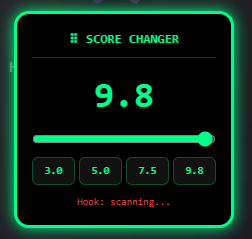

# Omoggle Score Changer

A Tampermonkey userscript that lets you set your own score on [Omoggle](https://omoggle.com).

## Installation

1. Install [Tampermonkey](https://www.tampermonkey.net/) for your browser
2. Click **Create a new script**
3. Paste the contents of `score-changer.js` and save
4. Navigate to Omoggle — the UI will appear automatically

## Usage

- **Slider** — drag to set your score from 0.0 to 10.0
- **Preset buttons** — quick set to 3.0 / 5.0 / 7.5 / 9.8
- **Hook: ACTIVE ✓** — green means the patch is working
- **Hook: scanning...** — wait a few seconds, it will activate automatically
- Drag the panel by the header to move it anywhere on screen

## How It Works

The script injects into the page's JavaScript context and hooks into the webpack module that handles facial scoring. It intercepts the scoring functions (`VA`, `cv`, `cM`) and replaces the calculated score with your chosen value before it reaches the display and before it gets submitted to the server at match finalization.

The hook scans webpack modules asynchronously in batches of 500 so the page stays responsive while it searches.

## Notes

- **Wait for ACTIVE ✓** before starting a match — if you join before the hook is ready the real score will be used
- The score you set affects both what your opponent sees during the match and the final submitted score
- Refresh the page if the hook takes more than 30 seconds to activate
- The panel can be dragged anywhere on screen by clicking and holding the header

## Compatibility

| Browser | Supported |
|---------|-----------|
| Chrome  | ✅ |
| Firefox | ✅ |
| Edge    | ✅ |
| Safari  | ⚠️ Tampermonkey support varies |

## Disclaimer

This script is for educational purposes only. Use at your own risk.
